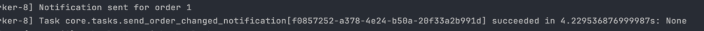

# Asynchronous Processing

 I will use celery to perform tasks that are not necessary for now and I don’t want to fill the main thread with them.
 
Firstly install celery to the django project.

Create a new file in the config folder with the following content.

```python

import os

from celery import Celery

os.environ.setdefault('DJANGO_SETTINGS_MODULE', 'config.settings')

celery_app = Celery("e-commerce")

celery_app.config_from_object("django.conf:settings", namespace="CELERY")

celery_app.autodiscover_tasks()

```

And then create a task:
```python
from celery import shared_task
from logging import getLogger
from core.models.orders import Order
import time

logger = getLogger(__name__)


@shared_task
def send_order_changed_notification(order_id: int, message="Order status changed"):
    logger.info(f"Order {order_id}: {message}")

    try:
        order = Order.objects.get(id=order_id)
    except Order.DoesNotExist:
        logger.error(f"Order {order_id} not found")
        return

    # logic to send notification to user
    time.sleep(4)

    logger.info(f"Notification sent for order {order_id}")

```
For now I will just mock this function, so we just imagine that there is some cool logic.

And then just call the API to change status.


