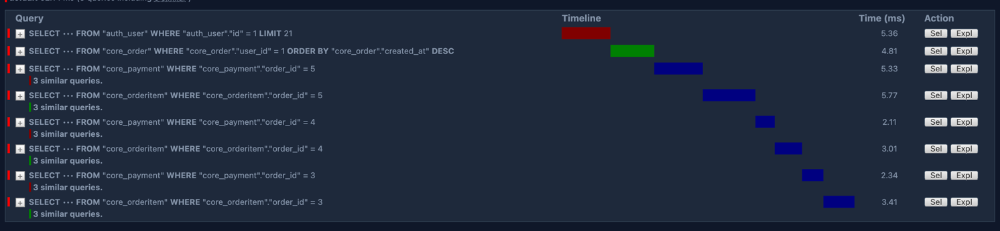
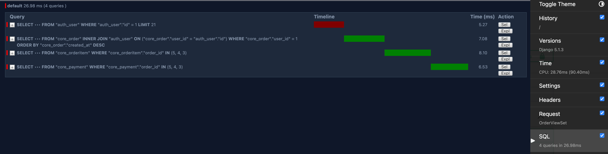

# Database optimization

## Schema
As we create a good schema in sometime we don't even need indexes(will be shown later).
For example in this schema we have a table orders:
```python
class Order(TimeStampedModel):
    class Status(models.TextChoices):
        NEW = "new", "New"
        IN_PROGRESS = "in_progress", "In progress"
        DONE = "done", "Done"
        CANCELED = "canceled", "Canceled"

    user = models.ForeignKey("auth.User", on_delete=models.CASCADE, related_name="orders")
    status = models.CharField(max_length=20, choices=Status.choices, default=Status.NEW)
    total_price = models.DecimalField(max_digits=10, decimal_places=2, default=0)
```
Very simple, just 3 columns (5 to be honest because I have created_at and updated_at columns in TimeStampedModel).

```plaintext
                                    Table "public.core_order"
   Column    |           Type           | Collation | Nullable |             Default
-------------+--------------------------+-----------+----------+----------------------------------
 id          | bigint                   |           | not null | generated by default as identity
 created_at  | timestamp with time zone |           | not null |
 updated_at  | timestamp with time zone |           | not null |
 status      | character varying(20)    |           | not null |
 total_price | numeric(10,2)            |           | not null |
 user_id     | integer                  |           | not null |
Indexes:
    "core_order_pkey" PRIMARY KEY, btree (id)
    "core_order_user_id_b03bbffd" btree (user_id)

```

## Indexes

Firstly of course I decided to use indexes.

For example in orders:

```python
    class Meta:
        ordering = ["-created_at"]
        indexes = [models.Index(fields=["user"])]
```

And this will create an index for order on column user.
This is how it looks in the migration file:
```python
migrations.AddIndex(
    model_name='order',
    index=models.Index(fields=['user'], name='core_order_user_id_f84106_idx'),
),
```
And in database:
```plaintext
 public | core_order_pkey                                                | index | final | core_order
 public | core_order_user_id_b03bbffd                                    | index | final | core_order
 public | core_order_user_id_f84106_idx                                  | index | final | core_order
```
Also as we see, Django creates an index for foreign key by default.

But it is needed if we want to create complex indexes, for example for multiple columns.

```python
 class Meta:
        verbose_name = "Review"
        verbose_name_plural = "Reviews"
        unique_together = ["product", "user"]
        indexes = [models.Index(fields=["product", "user"])]
```

```plaintext
 public | core_review_product_id_user_id_8f834a72_uniq                   | index | final | core_review
```

## Query optimization
So, we need to escape the n+1 problem, for example we have an order with a lot of order items.

The request was 148 ms, 45.17 for sql

```python
queryset = Order.objects.select_related("user").prefetch_related("items", "payments")
```

And now the request is 90.4 ms and 25.98 for sql.

And we make now 2 times less queries.
