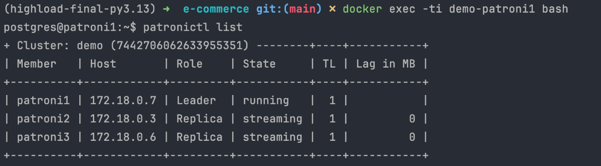
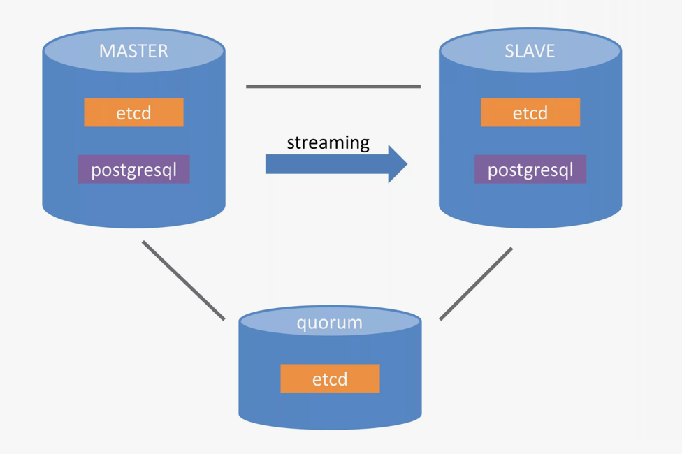

# Distributed Systems

As I use the PostgreSQL database for storing the data it is good to use some kind 
of distributed system that is natively supports integration or even management of PostgreSQL.


And of course I can use self managed system, or even write own one.
For example I can up a cluster with some PostgreSQL instances and balance traffic with any load balancer or pgbouncer.

But there is a system which is called Patroni. It is a template for PostgreSQL High Availability with Zookeeper, etcd or Consul.

And for my system I decided to use a etcd as a distributed key-value store for Patroni.

## Patroni
So, here is how I managed to set up a Patroni cluster with etcd.

Firstly there is a pretty clear documentation for the Patroni on the github: https://github.com/patroni/patroni

> Interesting thing is that Patroni doesn't have a Docker image on docker hub and so if you want to use it you need to build image 
> by yourself.
> 
> Good news is that this is easy, just `docker build .` in patroni folder.
>
> 

So, after I built the image I can start the Patroni cluster with docker-compose.yml file.

This is how it can be managed.
```yaml
    etcd1: &etcd
      image: patroni
      environment:
        ETCD_LISTEN_PEER_URLS: http://0.0.0.0:2380
        ETCD_LISTEN_CLIENT_URLS: http://0.0.0.0:2379
        ETCD_INITIAL_CLUSTER: etcd1=http://etcd1:2380,etcd2=http://etcd2:2380,etcd3=http://etcd3:2380
        ETCD_INITIAL_CLUSTER_STATE: new
        ETCD_INITIAL_CLUSTER_TOKEN: tutorial
        ETCD_UNSUPPORTED_ARCH: arm64
      container_name: demo-etcd1
      hostname: etcd1
      command: etcd --name etcd1 --initial-advertise-peer-urls http://etcd1:2380

    etcd2:
      <<: *etcd
      container_name: demo-etcd2
      hostname: etcd2
      command: etcd --name etcd2 --initial-advertise-peer-urls http://etcd2:2380

    etcd3:
      <<: *etcd
      container_name: demo-etcd3
      hostname: etcd3
      command: etcd --name etcd3 --initial-advertise-peer-urls http://etcd3:2380

    haproxy:
      image: patroni
      env_file: database/.env
      hostname: haproxy
      container_name: demo-haproxy
      ports:
        - "5002:5000"
        - "5001:5001"
      command: haproxy
      environment: &haproxy_env
        ETCDCTL_ENDPOINTS: http://etcd1:2379,http://etcd2:2379,http://etcd3:2379
        PATRONI_ETCD3_HOSTS: "'etcd1:2379','etcd2:2379','etcd3:2379'"
        PATRONI_SCOPE: demo

    patroni1:
      image: patroni
      env_file: database/.env
      hostname: patroni1
      container_name: demo-patroni1
      environment:
        <<: *haproxy_env
        PATRONI_NAME: patroni1

    patroni2:
      image: patroni
      env_file: database/.env
      hostname: patroni2
      container_name: demo-patroni2
      environment:
        <<: *haproxy_env
        PATRONI_NAME: patroni2

    patroni3:
      image: patroni
      env_file: database/.env
      hostname: patroni3
      container_name: demo-patroni3
      environment:
        <<: *haproxy_env
        PATRONI_NAME: patroni3
```

Also you can see that there is no need for a postgres container because patroni inside managing the postgres by its own.

And this is how I can check that everything is working fine.


And here we see that we have the Leader of the cluster(Master) that is selected by the Raft algorithm.
And 2 Replicas (Slave) of the Leader that are streaming data from it.

And, that's it, just the ready cluster for usage.

By the way, we are using HAProxy for balancing the traffic between the instances.

And the final infrastructure of database looks like this:


