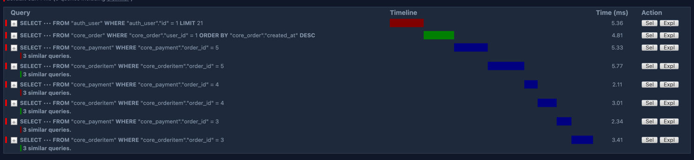
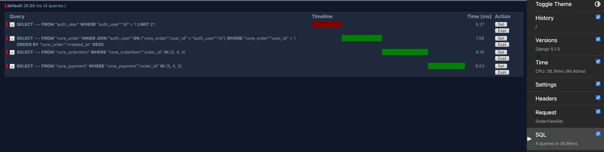

# Performance Tuning

I handled performance tuning with the siege tool. I used the following command to test the performance of the application:

```bash
siege -c 100 -r 10 -b http://localhost:80/
```

And here what I found, the load balancing actually works and when I have 3 instances with load balancer they work 3x faster than a single instance.

Load balanced


Single instance


Also as a performance tuning I increased the max connections to postgres, and even setted up a Patroni cluster with etcd.

Okay, we have for now one instance, but by default it has only 100 connection limit, let’s increase this limit to 1000.

```conf
max_connections = 1000
```

About patroni you can read here:
[distributed_systems.md](distributed_systems.md)

## Query optimization
So, we need to escape the n+1 problem, for example we have an order with a lot of order items.

The request was 148 ms, 45.17 for sql

```python
queryset = Order.objects.select_related("user").prefetch_related("items", "payments")
```

And now the request is 90.4 ms and 25.98 for sql.

And we make now 2 times less queries.