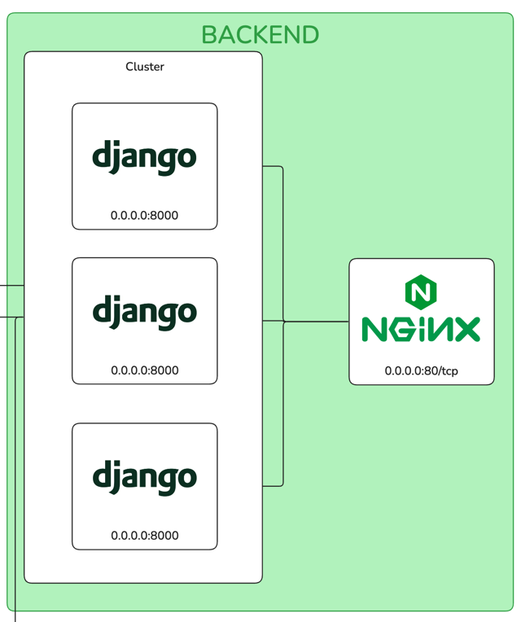
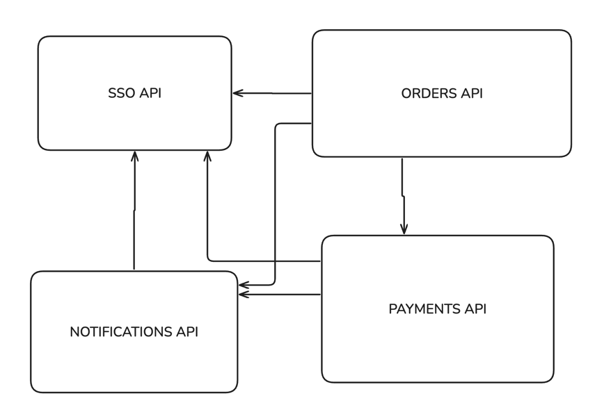
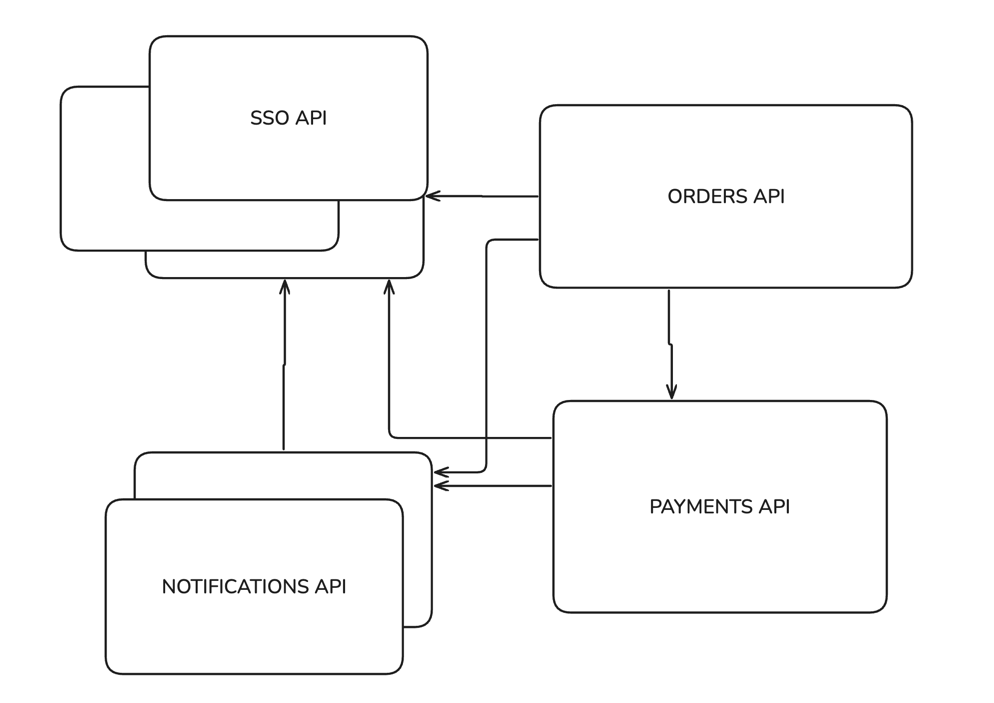

# Scaling

So, scaling. Firstly let's consider that now our application is a monolith. 
It's a single application that does everything. It's a single process that handles all the requests, 
all the database connections, all the file uploads, etc. This is fine for small applications, 
but as the application grows, it will become a bottleneck. The application will not be able to handle the load, 
and it will become slow and unresponsive.

For first steps to increasing the performance we can just up the another instance and load balance traffic between them.

This is how we solve it in this work.



And to configure that we can use this simple setup.

This is `docker-compose.yml` file.
```yaml
nginx:
  image: nginx:1.21.3-alpine
  <<: *default-logging
  volumes:
    - ./nginx/nginx.conf:/etc/nginx/conf.d/default.conf
    - static-volume:/app/var/static
  ports:
    - "80:80"
  depends_on:
    - server
    - server2
    - server3

server: &server
  restart: always
  <<: *default-logging
  build:
    context: ./e-commerce/
  env_file:
    - ./e-commerce/.env
  depends_on:
    - haproxy-database
  volumes:
    - static-volume:/app/var/static
  deploy:
    resources:
      reservations:
        cpus: '0.5'
        memory: 50M
      limits:
        cpus: '1'
        memory: 100M

server2:
  <<: *server
  ports:
    - "8000:8000"

server3:
  <<: *server
```

With this setup we have 3 instances of our application and nginx as a load balancer.

And this setup easily handles 3x more requests than a single instance.

But now it is suitable for us because we have a small application.

But when the application grows we unfortunately will have to split the application into microservices.

And this is how it might look like.



Here we have 4 services: "sso", "orders", "notifications", and "payments".

Also we might want to have separate backend for products but let's leave it for now.

And now if we need to create more instances of the "notifications" because there are too many of them, or for "sso", because there are too many users.
We can easily add more instances without affecting other services.



So this is how I will be scaling microservices in this work.